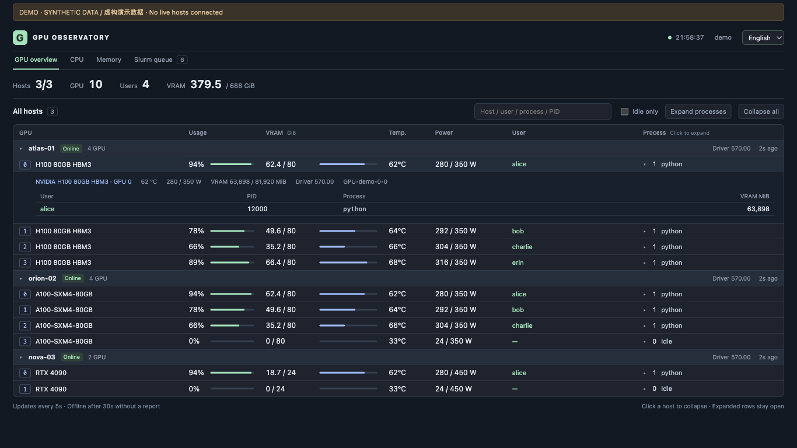
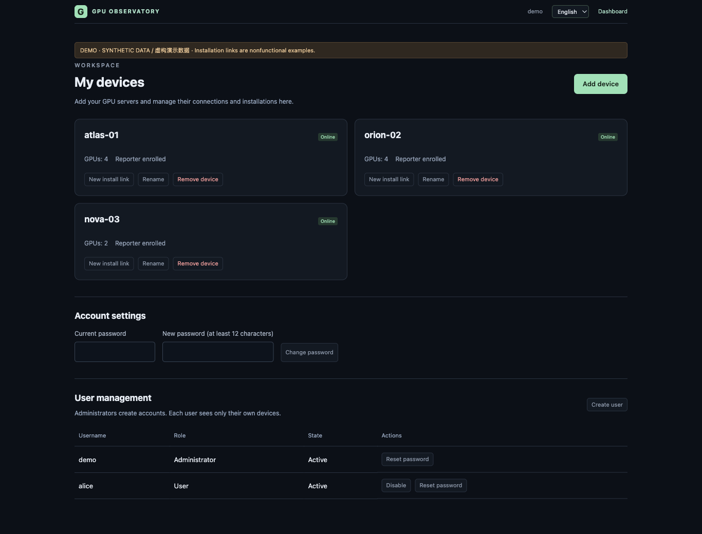
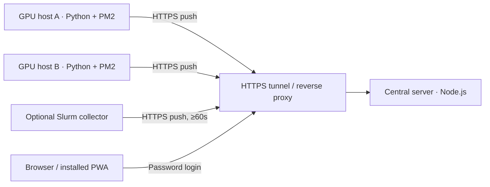
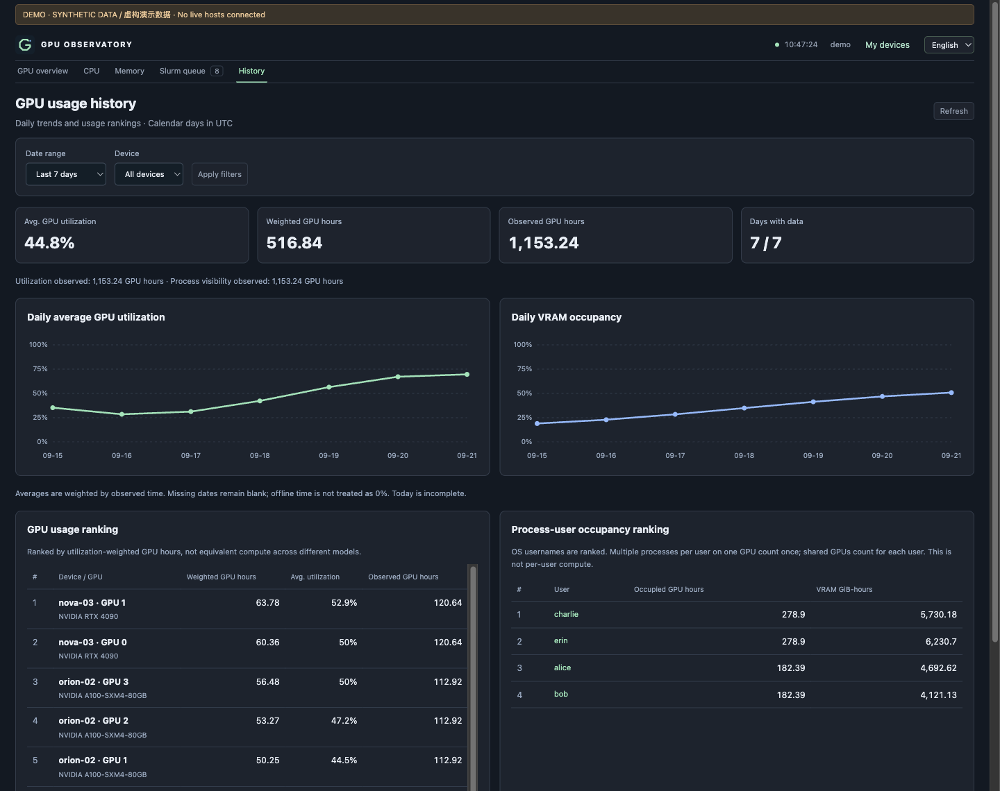
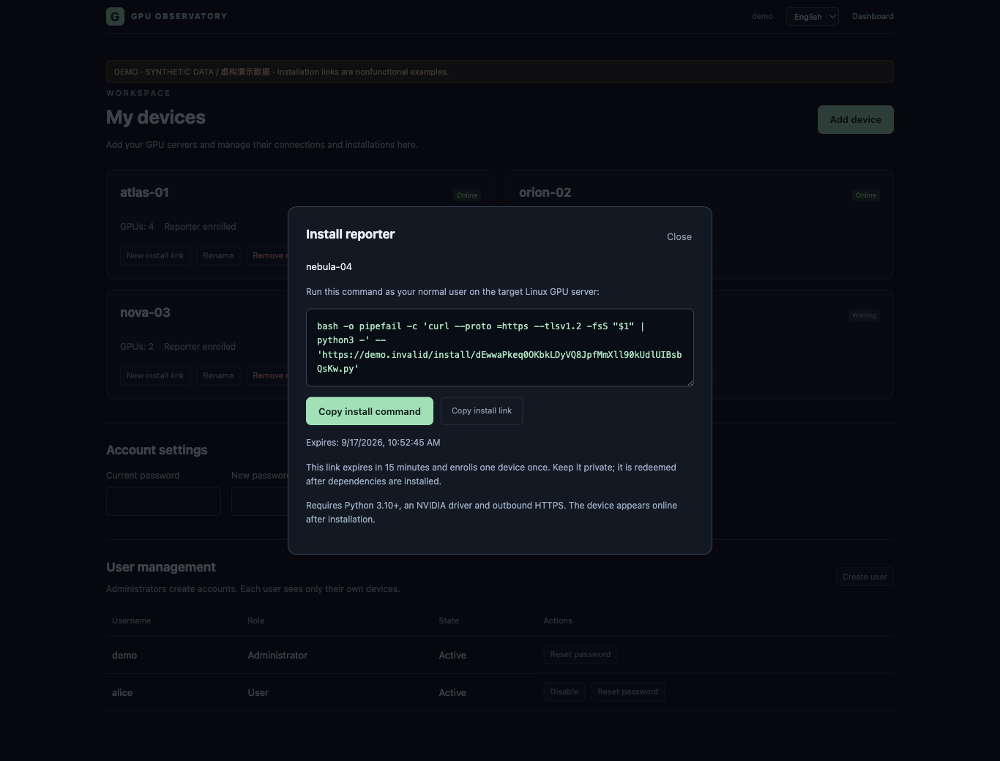
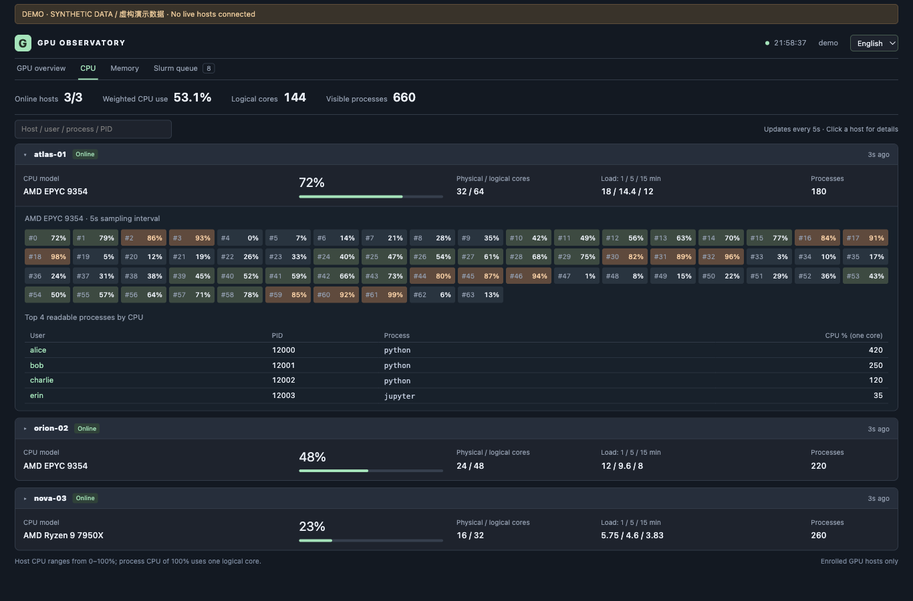
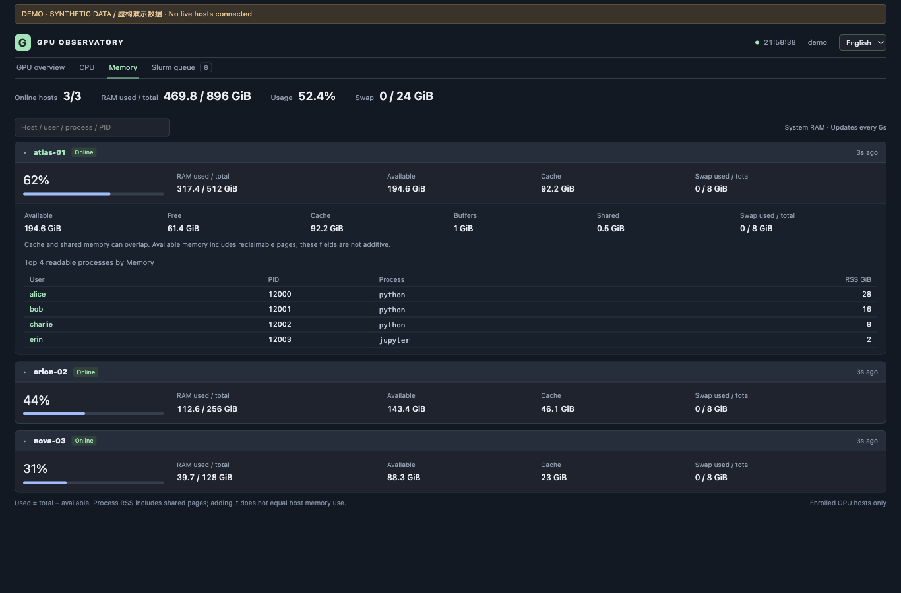
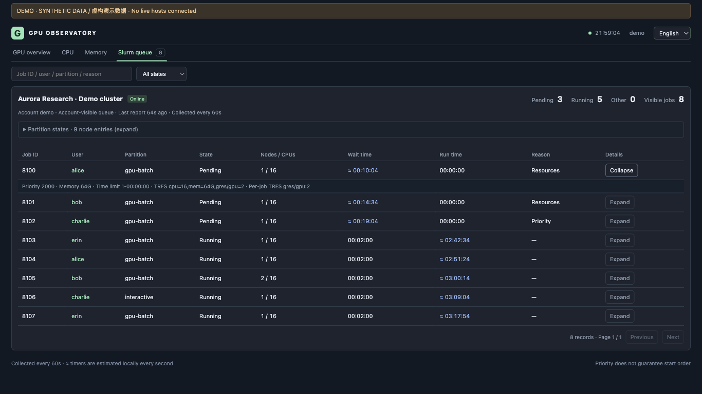

<p></p>

# GPU Observatory

**Know who is using your GPUs — across every machine, in one compact dashboard.**

[简体中文](README.zh-CN.md) · [Agent deployment guide](docs/DEPLOYMENT_FOR_AGENTS.md) · [Security](SECURITY.md) · [MIT license](LICENSE)

GPU Observatory is a self-hosted, push-based monitor for NVIDIA GPU fleets, CPU/RAM usage and optional Slurm queues. Lightweight reporters send metrics to one authenticated central server. Expand a row to see **the user, PID, process and memory usage** behind a busy GPU.



*All screenshots use an isolated synthetic demo. Hostnames, usernames, jobs and metrics are invented; no live infrastructure is shown.*

## Personal workspaces and one-command enrollment

Administrators create user accounts and can view a limited device inventory (owner, device name and GPU models only). Each user has a private **My devices** page to add, rename and remove their GPU servers. **Add device** generates a one-command installer bound to this hub: copy it onto the GPU server to install dependencies, enroll with a short-lived single-use link and start an isolated PM2 reporter, without sudo.



[User management and upgrade guide](docs/USER_MANAGEMENT.md) covers permissions, installation, credential revocation, recovery and migration from version 1. Existing accounts become administrators and retain their original devices.

## What it does

- **History & rankings:** private SQLite storage, daily utilization/VRAM trends, date/device filters, GPU usage and process-user occupancy rankings. [Storage and methodology](docs/HISTORY.md).
- **GPU:** usage, VRAM, temperature, power, users and processes; search, idle-only filtering and expandable rows.
- **CPU:** total/per-core usage, load averages and top readable processes by user and PID.
- **Memory:** RAM, available memory, cache, swap and top readable processes with usernames and RSS. RSS includes shared pages, so process totals are not a precise per-user share of host memory.
- **Slurm:** optional account-visible jobs, pending/running counts, partitions, reasons, priority and wait/run times. Timers advance between collection intervals and stop extrapolating when data is stale.
- **Compact bilingual UI:** English and Chinese, mobile layout, preserved expansion state and installable PWA. Private metrics are never cached for offline use.
- **Push architecture:** reporters need only outbound HTTPS. Five-second GPU/CPU/RAM reports; Slurm polling is at least 60 seconds. No inbound SSH polling by the hub.
- **Private by default:** password login, source-bound reporter tokens, strict origin checks, rate limits and loopback-only hub binding. User-space PM2 deployment requires no sudo.

## You need a central server

A small VPS, home server, Mac or always-on workstation can serve as the hub; **it does not need a GPU**. It must stay online and be reachable over HTTPS by every reporter. Install Node.js 22.16+ on the hub. Reporters currently target Linux NVIDIA machines with Python 3.10+, NVML and user-space Node/PM2.



| Public address | Requirements | When to use |
| --- | --- | --- |
| Cloudflare Quick Tunnel | No account or domain | Try it immediately; a random URL changes whenever the tunnel restarts. |
| Own domain + named tunnel | Cloudflare account and configured domain | Recommended for persistent use: stable reporter endpoints, bookmarks and desktop app origin. |
| Existing HTTPS reverse proxy | Stable HTTPS hostname and proxy configuration | Reuse your own ingress; keep application authentication enabled. |

Cloudflare describes Quick Tunnels as development/testing services without an uptime SLA. They have a 200 concurrent-request limit and no SSE; this dashboard uses polling. [Official Quick Tunnel documentation](https://developers.cloudflare.com/cloudflare-one/networks/connectors/cloudflare-tunnel/do-more-with-tunnels/trycloudflare/)

## Try the UI locally

No GPU, credentials, Python dependencies or Cloudflare account are needed for this preview:

```sh
git clone <this-repository-url> gpu-observatory
cd gpu-observatory
npm run demo
```

Open **http://127.0.0.1:8790**. The demo serves only invented fixtures, binds to loopback and never reads system metrics or production configuration. It is a preview, not the production server.

## Deploy with an agent

Give your coding agent this instruction, together with your private SSH inventory:

> Deploy GPU Observatory using AGENTS.md and docs/DEPLOYMENT_FOR_AGENTS.md. Use one central server and start with one GPU reporter. If I have no domain, use Cloudflare Quick Tunnel and explain how URL changes are handled. Keep secrets outside the repository, use isolated user-space PM2 without sudo, verify authentication and fresh telemetry, then enroll the remaining authorized hosts. Follow cluster policy before adding Slurm.

Once the hub is running, users can enroll devices from **My devices** without SSH access to the hub. The [runbook](docs/DEPLOYMENT_FOR_AGENTS.md) includes both tunnel options, exact setup commands, per-host enrollment, PM2 startup/recovery, optional Slurm, verification, upgrades and rollback. It distinguishes Linux boot recovery from macOS login startup and does not assume permission for cluster persistence.

For an already configured stable HTTPS ingress, the central setup is:

```sh
export HUB_STATE="$HOME/.local/share/gpu-observatory-hub"
node scripts/manage.mjs init --state "$HUB_STATE" --origin https://monitor.example.com --username admin
python3 deploy/setup-hub.py --state "$HUB_STATE"
node scripts/manage.mjs add-host gpu-01 --state "$HUB_STATE"
"$HUB_STATE/pm2.sh" restart gpu-dashboard
```

Read the generated login credential file privately. Transfer only that host's enrollment file to its reporter. The full runbook covers the remote installation; enrolling alone does not install a reporter.

**Quick Tunnel restart:** use `manage.mjs set-origin`, restart the hub, redistribute the updated enrollment files and restart reporters. This command preserves credentials but cannot update remote machines automatically. See [the URL-change procedure](docs/DEPLOYMENT_FOR_AGENTS.md#7-when-a-quick-tunnel-url-changes).

## More views

<details>
<summary><strong>History — daily GPU trends and usage rankings</strong></summary>



</details>

<details>
<summary><strong>One-command reporter installation</strong></summary>



</details>

<details>
<summary><strong>CPU — per-core heatmap and process owners</strong></summary>



</details>

<details>
<summary><strong>Memory — RAM breakdown and per-process RSS by user</strong></summary>



</details>

<details>
<summary><strong>Slurm — visible jobs, queue reasons and live durations</strong></summary>



</details>

## Scope and limitations

This dashboard targets small GPU fleets and includes a local SQLite history database. It is not an enterprise identity platform or a distributed metrics service. Each user has separate login credentials and can view only their own devices and assigned Slurm sources. Administrators manage accounts; dashboard data remains scoped to its owner. Live snapshots remain separate from private minute/day history aggregates; sessions are invalidated on hub restart. OS permissions can hide process owners or metrics. Unsupported readings stay unknown rather than appearing as zero.

Slurm visibility follows the collector account's permissions. An empty visible queue does not imply an idle cluster. Deploy collectors on managed login nodes only when site policy allows it. No GPU test workload is necessary to install the monitor.

Desktop installation depends on the browser, OS and HTTPS installability checks. Login still applies after installation. Offline mode shows a placeholder, never cached private telemetry. A stable domain is especially useful for installed apps.

## Development

The server uses Node built-ins and the frontend uses plain JavaScript/CSS. Python reporters use [gpustat](https://github.com/wookayin/gpustat), [psutil](https://github.com/giampaolo/psutil) and NVIDIA's NVML bindings. PM2 and cloudflared are deployment tools, not bundled binaries.

```sh
python3 -m venv .venv
. .venv/bin/activate
python -m pip install -r requirements.txt
npm test
python -m unittest discover -s tests -p 'test_*.py'
```

See [CONTRIBUTING.md](CONTRIBUTING.md). The project is MIT licensed; dependencies retain their own licenses.
